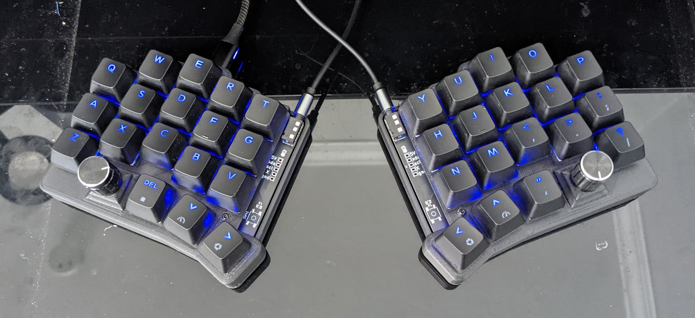
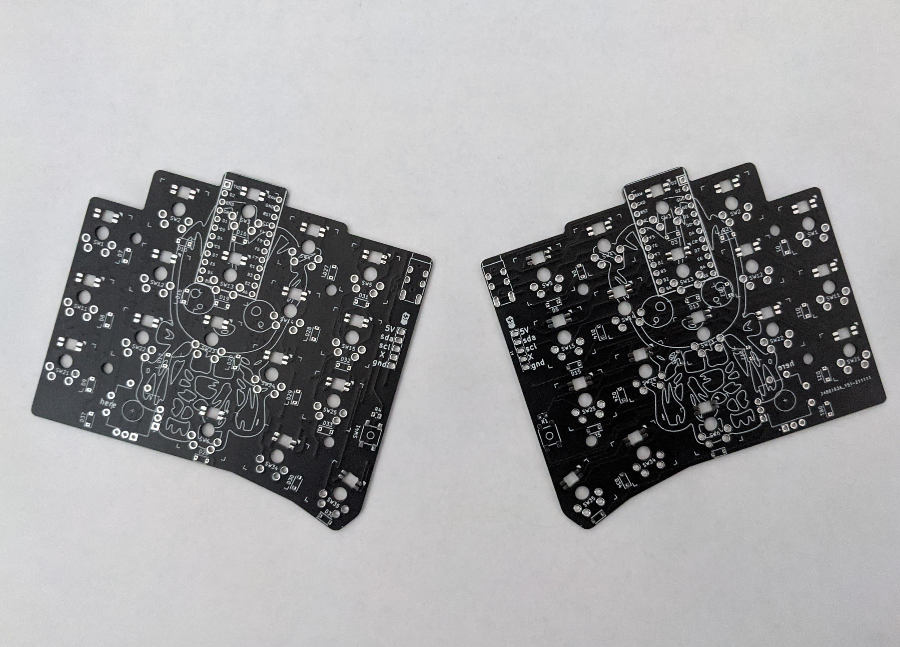

# Pronunciation

Baby Groot Keyboard (bgkeeb)

This is a reversible 100mm x 100mm pcb with support for mx switches (no hotswap), per key led, rotary encoders, and exposes the SDA/SCL/GND/VCC lines in the form of the pimoroni trackball pins (meaning you can add that as well, though the case doesn't support it, so you'll need to devise your own mechanism).

Given the pcb is so small, pcb prototype manufacturers will fab this for very cheap, or even free. As of this writing, nextpcb will ship fab and ship this keyboard 100% for free (in green only). jlcpcb will fab and ship these for $2 (USD).

# Support me!

I have spent a lot of time and money designing prototypes, testing, developing, etc. Any contributions would be greatly appreciated!

If you don't want to, or can't afford to support me, please send me a message to let me know you've built one, along with pictures. Also, feel free to submit a pull request with pictures into this repository. I'd be happy to showcase your build.

Reddit: /u/sadekbaroudi
Discord: sadekbaroudi#1258

# Pictures

