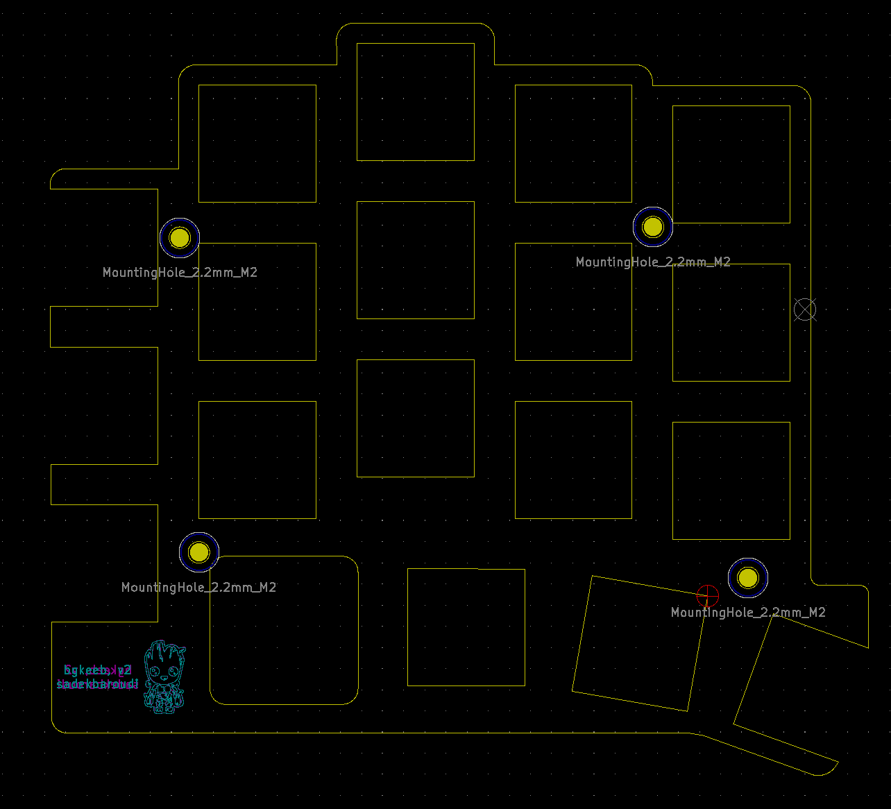
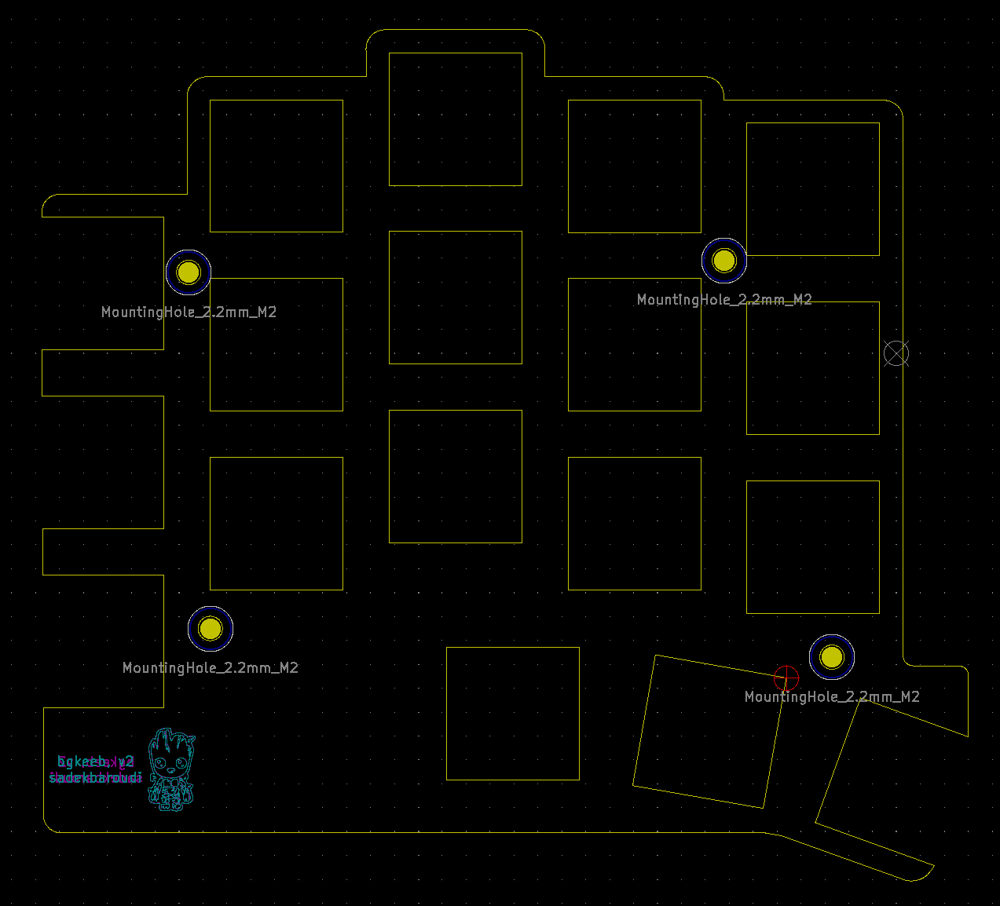
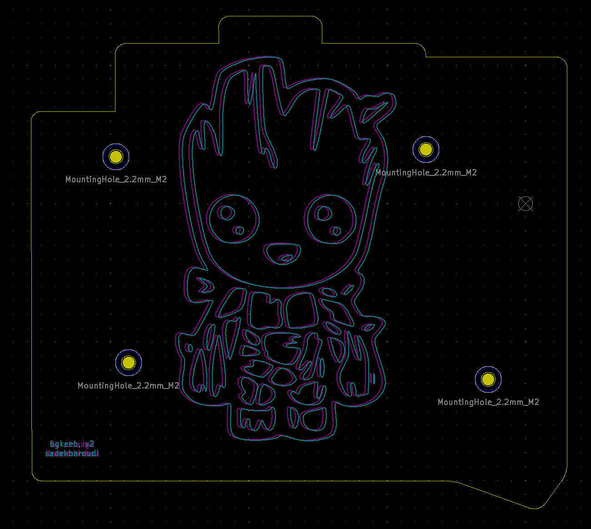

# FR-4 plates

Go into each directory, and fab the gerber.zip. 

You need the bottom plate and one of the two switchplates. If you are not going to use an encoder, use the no-encoder one

# Pictures

